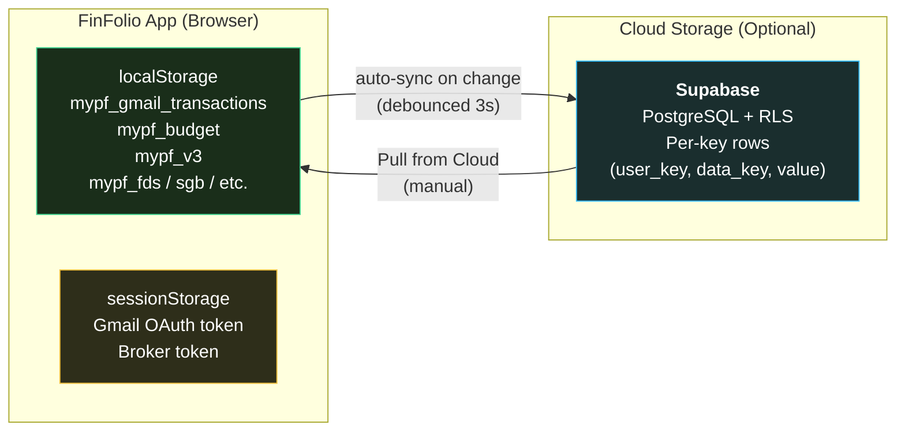
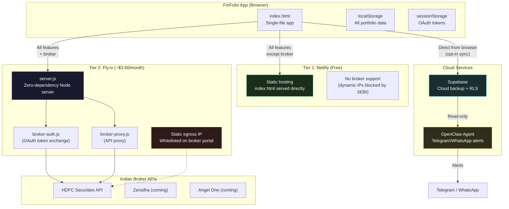

# FinFolio — Architecture Flow Diagrams

## 1. Gmail Expense Parsing Flow

How bank transaction emails are synced, parsed, and stored when the user clicks "Sync Now" on the Budget page.

```mermaid
flowchart TD
    A["User clicks<br/><b>Sync Now</b><br/>(Budget page)"] --> B{OAuth token<br/>valid?}
    B -- No --> C["ensureGmailToken()<br/>Trigger Google OAuth popup"]
    C --> D{User<br/>authorizes?}
    D -- No --> E["Show: Connect Gmail<br/>in Settings first"]
    D -- Yes --> F["Token stored in<br/>sessionStorage<br/>(1-hour expiry)"]
    B -- Yes --> F
    F --> G{Start & End<br/>dates set?}
    G -- No --> H["Show: Select<br/>start and end dates"]
    G -- Yes --> I["Build Gmail search query"]

    I --> J["<b>GMAIL_BANK_CONFIGS.hdfc.query</b><br/>from:alerts@hdfcbank.bank.in<br/>(subject:Account update OR<br/>subject:UPI txn OR<br/>subject:debited via Credit Card)<br/>+ after:YYYY/MM/DD<br/>+ before:YYYY/MM/DD"]

    J --> K["<b>Gmail API</b><br/>GET /gmail/v1/users/me/messages<br/>?q=search_query&maxResults=100"]
    K --> L{Messages<br/>found?}
    L -- No --> M["Show: No matching<br/>emails found"]
    L -- Yes --> N["Dedup: filter out<br/>messages already in<br/>localStorage by Gmail ID"]

    N --> O{New messages<br/>exist?}
    O -- No --> P["Show: All emails<br/>already synced"]
    O -- Yes --> Q["Fetch full message bodies<br/>(batches of 10)"]

    Q --> R["<b>Gmail API</b><br/>GET /messages/{id}?format=full<br/>per message"]
    R --> S["extractEmailBody()<br/>Decode base64url payload<br/>text/plain > text/html > strip tags"]

    S --> T["Collect email objects:<br/>{id, snippet, body, date}"]

    T --> U["Build budget categories<br/>from budgetData.fixed +<br/>budgetData.variable labels"]

    U --> V["<b>LLM Batch Parse</b><br/>(batches of 15 emails)"]

    V --> W["buildTransactionParsePrompt()<br/>- parseHint (3 HDFC formats)<br/>- category list for mapping<br/>- email bodies (500 char each)"]

    W --> X["<b>callAIProvider()</b><br/>Claude / OpenAI / Gemini /<br/>OpenRouter (user's choice)"]

    X --> Y["AI returns JSON array:<br/>{idx, merchant, amount, date,<br/>card, payment_method,<br/>type, category, budgetType}"]

    Y --> Z["Extract JSON from response<br/>regex match for [...] array"]

    Z --> AA["Map parsed results<br/>to source emails by idx"]

    AA --> AB["Build transaction objects:<br/>{id, date, merchant, amount,<br/>card, payment_method, type,<br/>category, budgetType}"]

    AB --> AC["Merge with existing<br/>transactions, sort by<br/>date descending"]

    AC --> AD["Save to<br/><b>localStorage</b><br/>mypf_gmail_transactions"]

    AD --> AE["Auto-sync triggered<br/>(scheduleSupaSync)"]

    AE --> AF["<b>Supabase</b><br/>Upsert all SYNC_KEYS"]

    AD --> AH["renderGmailTransactions()<br/>- Populate category filter<br/>- Draw donut pie chart<br/>- Render transaction table<br/>- Budget vs Actual cards"]

    style A fill:#1a1a2e,stroke:#4a9eff,color:#fff
    style J fill:#1a2e1a,stroke:#3ecf8e,color:#fff
    style K fill:#2e1a1a,stroke:#e8923a,color:#fff
    style R fill:#2e1a1a,stroke:#e8923a,color:#fff
    style X fill:#1a1a2e,stroke:#a78bfa,color:#fff
    style AD fill:#1a2e1a,stroke:#3ecf8e,color:#fff
    style AF fill:#1a2e2e,stroke:#38bdf8,color:#fff
    style AH fill:#2e2e1a,stroke:#f0c040,color:#fff
```



---

## 2. Data Sync Architecture

How data flows between the app and Supabase cloud backup.



---

## 3. Two-Tier Deployment Architecture

How the app supports both free (Netlify) and broker-enabled (Fly.io) deployments using the same codebase.



### How `server.js` Works

The Fly.io server is a zero-dependency Node.js HTTP server that reuses existing Netlify function handlers via an adapter pattern:

```
Browser → POST /api/broker-auth → server.js constructs Netlify-shaped event → broker-auth.js handler
Browser → POST /api/broker-proxy → server.js constructs Netlify-shaped event → broker-proxy.js handler
Browser → GET / or /auth/callback → serves index.html
```

- No Express, no npm install — uses built-in `node:http` and `node:fs`
- Same security headers as `netlify.toml` (CSP, HSTS, X-Frame-Options, etc.)
- Docker image: ~43MB (node:20-alpine)
- Machines auto-stop when idle, auto-start on request

### Why Fly.io?

As per SEBI Exchange circular (effective April 2026), all Indian broker APIs require API calls to originate from a registered static IP. Netlify Functions and Vercel Serverless use dynamic IPs, making them incompatible with this regulation. Fly.io provides:
- Static egress IPv4 (~$3.60/month)
- Mumbai region (`bom`) for low latency to Indian broker APIs
- Auto-stop/auto-start machines (pay only when running)

---

## Key Components Reference

| Component | Location | Purpose |
|-----------|----------|---------|
| `GMAIL_BANK_PRESETS` | `index.html` | Bank-specific Gmail query templates |
| `syncGmailTransactions()` | `index.html` | Main sync orchestrator (multi-bank) |
| `extractEmailBody()` | `index.html` | Decode base64url Gmail payload |
| `buildTransactionParsePrompt()` | `index.html` | LLM prompt with category mapping |
| `callAIProvider()` | `index.html` | Route to selected AI provider |
| `renderGmailTransactions()` | `index.html` | UI: table, pie chart, filters |
| `supaUpsertAll()` | `index.html` | Push per-key data to Supabase |
